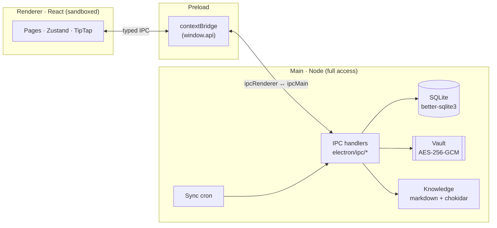
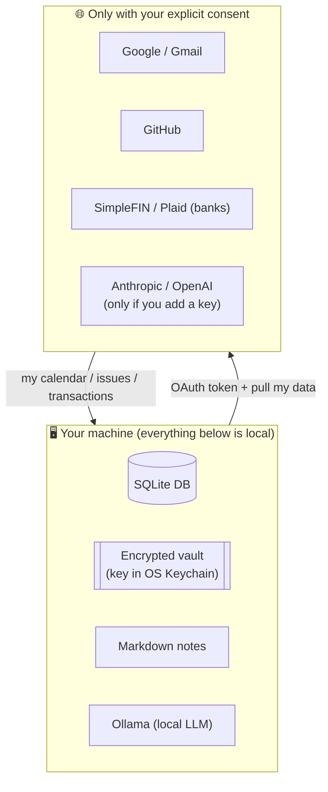
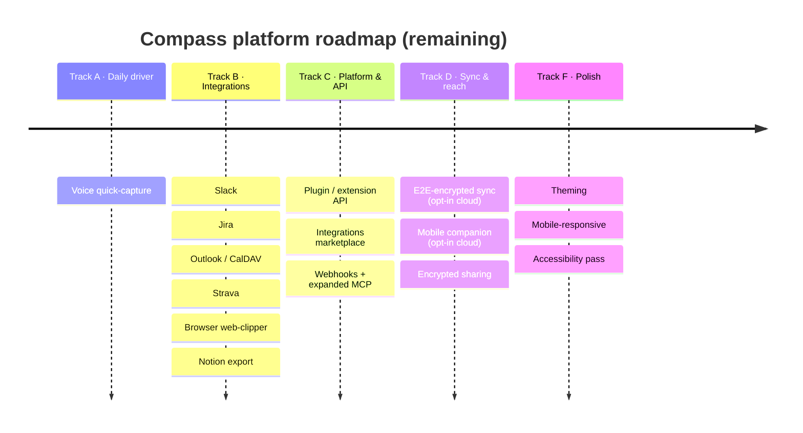

<div align="center">


# Compass

### Your private life, in one place — and it never leaves your machine.

A **local-first personal life OS** that unifies your finances, knowledge, calendar, tasks, habits, and an AI assistant into one fast desktop app. No cloud account. No data broker. Just your stuff, on your disk.


</div>

---


## What is Compass?

Most people run their life across a dozen apps — a budgeting SaaS that sells anonymized spend data, a note-taking tool syncing to someone else's cloud, a calendar, a habit tracker, a password manager, an AI chatbot trained on your prompts. **Compass collapses all of that into a single offline desktop app where the data lives on your machine and stays there.**

It's a *daily driver*: open it in the morning for your brief (calendar + tasks + money + inbox), capture notes and expenses through the day, and review your week on Sunday. The only thing that ever leaves your device is an OAuth token you explicitly grant (to pull your own Google/GitHub/bank data) — and even your AI assistant runs locally first.

## Who it's for

- **🛡️ The privacy-conscious power user** *(primary).* You already juggle Obsidian + YNAB/Monarch + Notion + a calendar, and you're tired of your life being scattered across five subscriptions that monetize you. Compass is the single private hub you've been hand-rolling.
- **🚀 The busy founder / professional.** You need a real command center — today's calendar, GitHub issues, email action items, and your cash position — without piping your company and personal life through someone else's servers.
- **🧠 The quantified-self / PKM enthusiast.** You want linked notes (`[[wikilinks]]` + backlinks), finances, and habit streaks in one searchable, scriptable, plain-files-on-disk store you fully own.

## Feature tour

| | |
|---|---|
| **Finance command center** — net worth, 90-day cash-flow forecast, subscription audit, budgets, tax tagging. |  |
| **90-day forecast** — projects subscriptions, income, debt minimums + calendar bills into a daily balance, with low-cash warnings. |  |
| **Storehouse & Timeline** — the Acquisition Engine: drop any data export (CSV / JSON / PDF / mbox / zip / SQLite) into the Drop Zone and Compass normalizes it into one append-only, searchable life timeline — PayPal, Venmo, Amazon, LinkedIn, Goodreads, streaming history, browser history, iMessage, Apple Health, and PDF letters (credit report, tax, Social Security). |  |
| **Knowledge base** — plain-markdown notes with `[[wikilinks]]`, backlinks, full-text + semantic search. |  |
| **Ask Compass** — a RAG assistant grounded in *your* knowledge base. Bring your own key; runs against local Ollama first. |  |
| **Weekly review** — a Sunday ritual: progress, open issues, what-went-well / blockers / next-week. |  |
| **Encrypted vault** — AES-256-GCM secrets (financial, identity, credentials, medical, legal). Master key in the OS Keychain — never on disk in plaintext. |  |

> Screenshots are generated from synthetic demo data via `npm run screenshots`. No real data is ever shown.

## Feature matrix

✅ Available today · 🔜 Upcoming (see [Roadmap](#roadmap))

| Area | Capabilities |
|---|---|
| **💰 Finance** | ✅ CSV / PDF / Excel statement ingest · ✅ auto-categorization · ✅ net-worth tracking + trajectory · ✅ 90-day cash-flow forecast · ✅ subscription & price-hike audit · ✅ budgets · ✅ Schedule C/E + capex tax tagging + tax-pack export · ✅ SimpleFIN bank + card sync (recommended; incl. Amex) · ✅ Plaid bank-linking (advanced) · 🔜 receipts via email · 🔜 investment holdings |
| **🗂️ Storehouse** | ✅ Drop Zone for any data export (CSV / JSON / XML / mbox / zip / SQLite / PDF) · ✅ append-only searchable **Timeline** · ✅ "on this day" recap · ✅ recognizers: PayPal · Venmo · Amazon · LinkedIn · Goodreads · Netflix / Spotify / YouTube history · Chrome / Firefox / Safari history · iMessage · Apple Health · email (mbox) · ✅ PDF recognizers: credit report · tax docs · Social Security statement · ✅ Contacts · ✅ Data-Rights Concierge · ✅ assisted-login portal pull (SSA, *beta*) |
| **📚 Knowledge** | ✅ markdown notes · ✅ `[[wikilinks]]` + backlinks · ✅ TipTap rich editor · ✅ full-text + semantic (local-embedding) search · ✅ Spotlight mirror · ✅ Obsidian vault bridge (import + export) · ✅ Notion import · 🔜 Notion export · 🔜 web clipper |
| **🔐 Vault** | ✅ AES-256-GCM encrypted categories · ✅ OS-Keychain master key · ✅ auto-lock · ✅ 1Password CSV import · 🔜 encrypted sharing with a trusted partner |
| **📅 Calendar** | ✅ Google Calendar · ✅ Apple Calendar (local `.ics`, RRULE expansion) · 🔜 Outlook / Office 365 · 🔜 CalDAV |
| **✅ Tasks & habits** | ✅ daily / weekly / monthly checklists · ✅ habit streaks · ✅ tray quick-capture · ✅ multi-type capture bar (task / note / expense) · ✅ `compass://` URL scheme · ✅ Todoist sync · ✅ Things 3 import · 🔜 Reminders sync · 🔜 voice capture |
| **🤖 Assistant** | ✅ RAG over your knowledge base · ✅ BYO Anthropic/OpenAI key · ✅ local Ollama option · ✅ agentic mode (Claude tool-use over your data; proposes changes via the Claude Inbox) · ✅ proactive insights · ✅ Morning Brief digest (low-cash + price-hike alerts) |
| **🔎 Search** | ✅ global ⌘K across notes, tasks, vault titles, transactions |
| **🔗 Integrations** | ✅ Google · ✅ GitHub · ✅ Gmail action items · ✅ SimpleFIN · ✅ Plaid · ✅ Apple Calendar · ✅ Linear · ✅ Todoist · 🔜 Slack · 🔜 Jira · 🔜 Strava · 🔜 browser extension |
| **🧩 Platform** | ✅ local MCP server (agent introspection) · ✅ encrypted backup / restore · ✅ auto-update · 🔜 public plugin API + marketplace · 🔜 opt-in E2E-encrypted sync · 🔜 mobile companion |
| **🤝 Claude** | ✅ MCP (read + propose) for Claude Code · ✅ BYO-key Ask Compass · ✅ confirmed-write **Claude Inbox** · ✅ end-user plugin + Compass skills (morning brief, weekly review, budget check, plan-my-week, web capture) · ✅ embedded agentic Ask Compass (Claude tool-use + propose) · ✅ one-click `.mcpb` Claude Desktop bundle · ✅ `compass_timeline` MCP tool (query your whole Timeline from Claude) |

## Works with Claude

Compass **works with Claude in both directions** — it exposes its data to Claude over MCP, and embeds Claude inside the app — built so an assistant can help with your life OS *without* silently mutating it or leaking it. Full design: [`docs/claude-integration.md`](docs/claude-integration.md).

- **Claude reads your Compass** — *today* via the MCP in Claude Code ("what's on my plate today?", "search my notes for X", "show my Timeline"), and via the **end-user plugin** (`claude-plugin/`) in Cowork/Desktop with ready-made skills (morning brief, weekly review, budget check). A **one-click `.mcpb` bundle** (`npm run build:mcpb`) installs the read+propose server into Claude Desktop.
- **Claude acts on your Compass** — *today* through **confirmed writes**: Claude *proposes* a change (a task, a note, a transaction tag) via the MCP and you **approve it in the Claude Inbox** inside Compass. Compass stays the sole writer; every change is human-approved.
- **Compass embeds Claude** — "Ask Compass" answers grounded in your knowledge base (BYO key, local-Ollama-first), plus an **Agent mode** where Claude reads your agenda + finance summaries via tools and **proposes** changes you approve in the Claude Inbox (e.g. "plan my week"). Proactive insights surface anomalies and nudges in-app.

> 🔒 **What Claude never sees:** your **vault** (secrets) is categorically excluded, and finance is exposed as **summaries, not raw transactions**. Cloud LLM access is always BYO-key and opt-in. See the [security model](docs/claude-integration.md#claude-inbox).

## Architecture

Compass is an Electron app with a hard security boundary: the React renderer is sandboxed and can **only** talk to the Node main process through a typed IPC bridge. All data — SQLite DB, encrypted vault, markdown knowledge base — lives in your OS application-data directory (on macOS, the primary target: `~/Library/Application Support/Compass/`).



**`contextIsolation: true`, `nodeIntegration: false`** — the renderer never imports Node. CSP blocks remote scripts and eval in production.

### Your data stays yours

The only bytes that leave your machine are OAuth tokens (encrypted at rest) and the API calls *you* opt into — to pull *your own* data back.



## Tech stack

**Electron 41** · **React 18** + **TypeScript** · **Drizzle ORM** / **SQLite** (`better-sqlite3`) · **TipTap** editor · **Recharts** · **Tailwind** (indigo-on-navy theme, Inter + JetBrains Mono) · **Vitest** + **Playwright** · **Biome** · **electron-vite** / **electron-builder**.

## Getting started

```bash
# Prerequisites: Node 20+ (nvm), npm
npm install          # installs deps + rebuilds native modules for Electron
npm run dev          # Electron + Vite HMR
npm run build        # production build
npm run typecheck    # renderer + main type-check
npm run check        # Biome lint + format
npm test             # Vitest unit tests
```

Primary target is **macOS** (signed releases via GitHub Actions); Windows (`nsis`/portable) and Linux (`AppImage`/`deb`) build targets exist. First launch seeds a starter knowledge base and an onboarding wizard.

## Roadmap

Compass is **100% local today.** The roadmap below is an expert-team evaluation of what turns it into a daily driver and a platform. Items marked *(opt-in cloud)* are a deliberate, clearly-bounded departure from local-only — always opt-in, never the default. Full detail + sizing lives in [`docs/implementation_plan.md`](docs/implementation_plan.md) (Phases 0–11). The latest direction — a cross-border / retirement layer (**Phase 11**) — comes from the June expert panel in [`docs/strategic-review-2026-06.md`](docs/strategic-review-2026-06.md).

Shipped so far: Morning Brief digest, weekly/monthly review rituals, multi-type quick-capture, Notion import + Obsidian bridge, Todoist / Things / Linear, proactive insights, the agentic "plan my week", plus the **Storehouse** (Contacts · Subscriptions · Assets) and the **Acquisition Engine** (Drop Zone · Timeline · ~44 recognizers · People · Data-Rights Concierge). What's still ahead:



## Privacy & security

- **Local-first by default** — data lives on disk; nothing is uploaded to a Compass server (there is no Compass server).
- **Vault** — AES-256-GCM, random IV + authTag per blob; master key generated once and sealed by the OS Keychain (`safeStorage`). Plaintext secrets never hit disk.
- **OAuth tokens** — encrypted at rest, kept in the main process, never exposed to the renderer or logs.
- **AI is opt-in and local-first** — Ask Compass prefers a local Ollama model; cloud LLM keys are BYO and only used on requests you trigger.
- **Hardened renderer** — `contextIsolation`, no `nodeIntegration`, production CSP with an explicit network allowlist.

See [`docs/architecture.md`](docs/architecture.md) for the full security model.

## Documentation

- [`docs/architecture.md`](docs/architecture.md) — process boundary, DB schema, IPC map, security model
- [`docs/conventions.md`](docs/conventions.md) — TS/React style, IPC + toast patterns
- [`docs/integrations.md`](docs/integrations.md) — how to add a new integration
- [`docs/implementation_plan.md`](docs/implementation_plan.md) — full feature ledger + roadmap (Phases 0–11)
- [`docs/storehouse-roadmap.md`](docs/storehouse-roadmap.md) — the Acquisition Engine (Phase 10) strategy + data-source catalog
- [`docs/strategic-review-2026-06.md`](docs/strategic-review-2026-06.md) — the June expert panel + the Phase 11 proposal

## License

Proprietary / all rights reserved (`UNLICENSED`). Not currently open for redistribution.
