<div align="center">

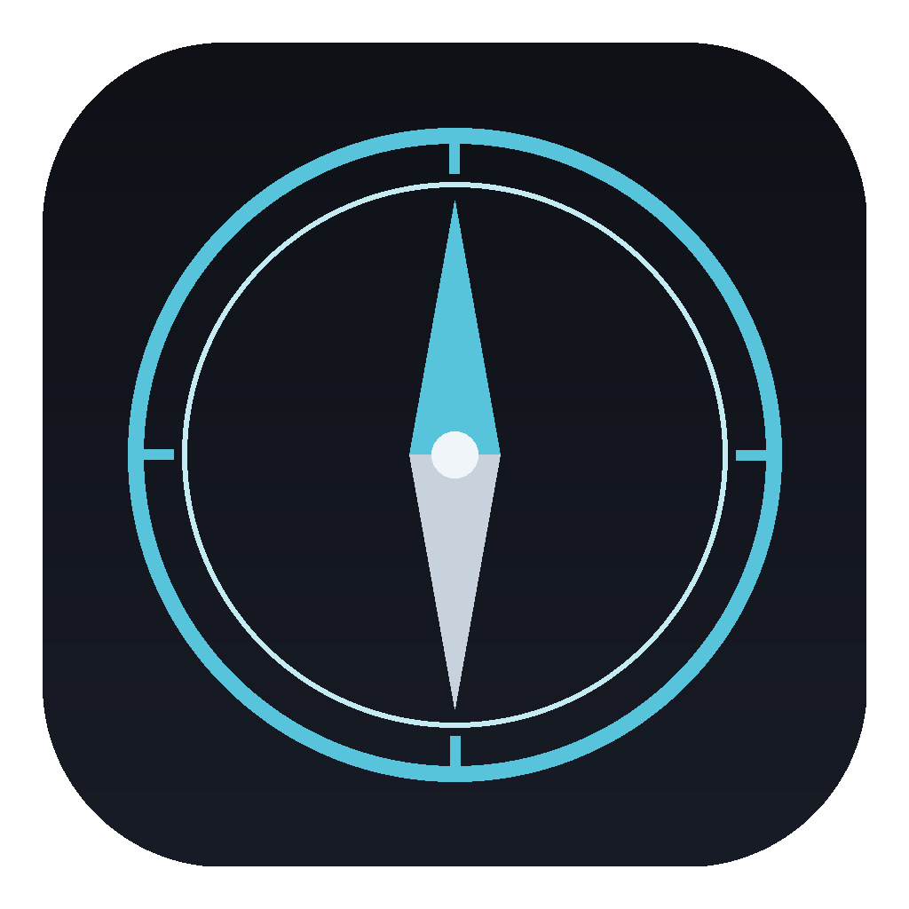

# Compass

### Your private life, in one place — and it never leaves your machine.

A **local-first personal life OS** that unifies your finances, knowledge, calendar, tasks, habits, and an AI assistant into one fast desktop app. No cloud account. No data broker. Just your stuff, on your disk.


</div>

---

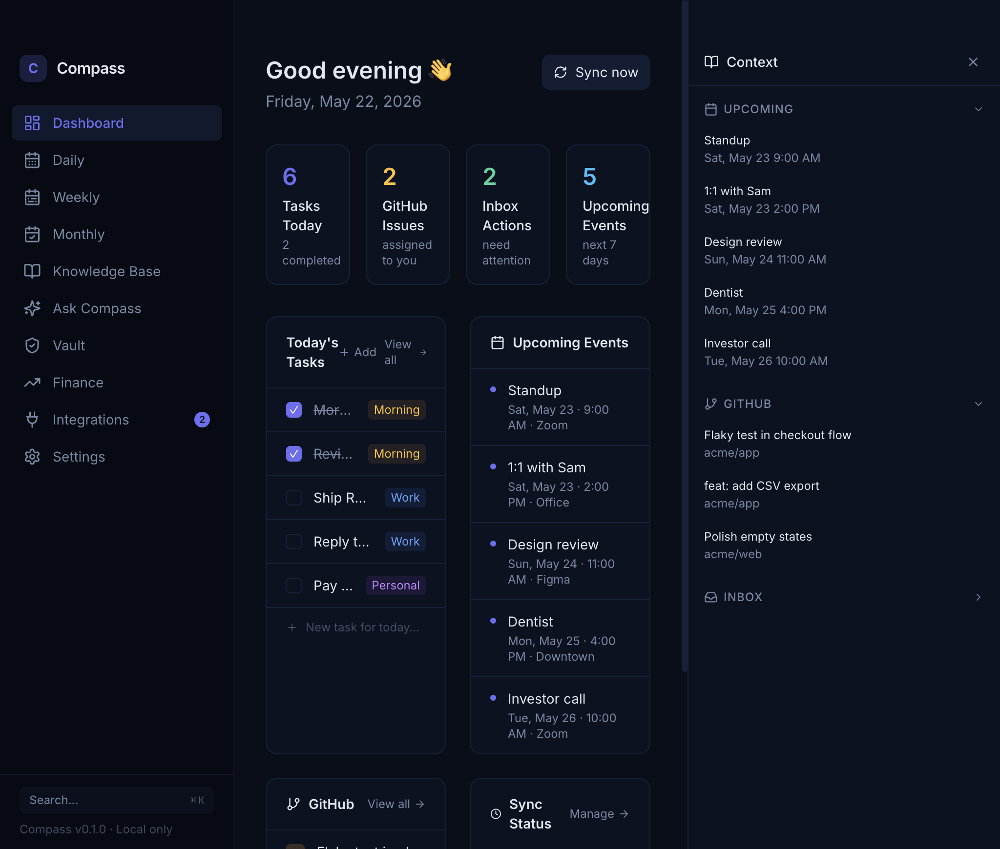

## What is Compass?

Most people run their life across a dozen apps — a budgeting SaaS that sells anonymized spend data, a note-taking tool syncing to someone else's cloud, a calendar, a habit tracker, a password manager, an AI chatbot trained on your prompts. **Compass collapses all of that into a single offline desktop app where the data lives on your machine and stays there.**

It's a *daily driver*: open it in the morning for your brief (calendar + tasks + money + inbox), capture notes and expenses through the day, and review your week on Sunday. The only thing that ever leaves your device is an OAuth token you explicitly grant (to pull your own Google/GitHub/bank data) — and even your AI assistant runs locally first.

## Who it's for

- **🛡️ The privacy-conscious power user** *(primary).* You already juggle Obsidian + YNAB/Monarch + Notion + a calendar, and you're tired of your life being scattered across five subscriptions that monetize you. Compass is the single private hub you've been hand-rolling.
- **🚀 The busy founder / professional.** You need a real command center — today's calendar, GitHub issues, email action items, and your cash position — without piping your company and personal life through someone else's servers.
- **🧠 The quantified-self / PKM enthusiast.** You want linked notes (`[[wikilinks]]` + backlinks), finances, and habit streaks in one searchable, scriptable, plain-files-on-disk store you fully own.

## Feature tour

| | |
|---|---|
| **Finance command center** — net worth, 90-day cash-flow forecast, subscription audit, budgets, tax tagging. | 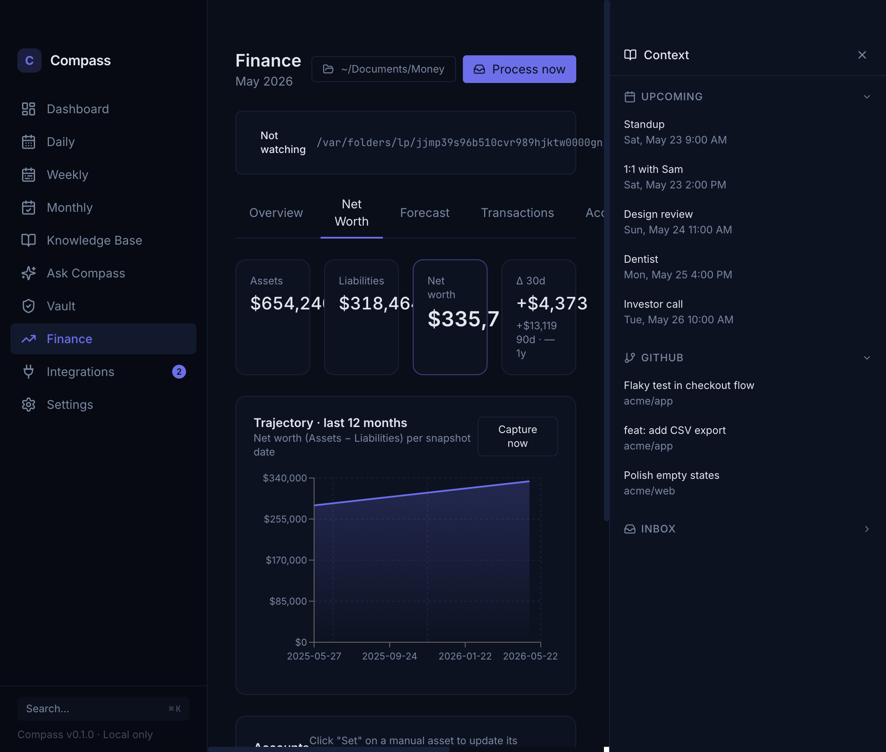 |
| **90-day forecast** — projects subscriptions, income, debt minimums + calendar bills into a daily balance, with low-cash warnings. | 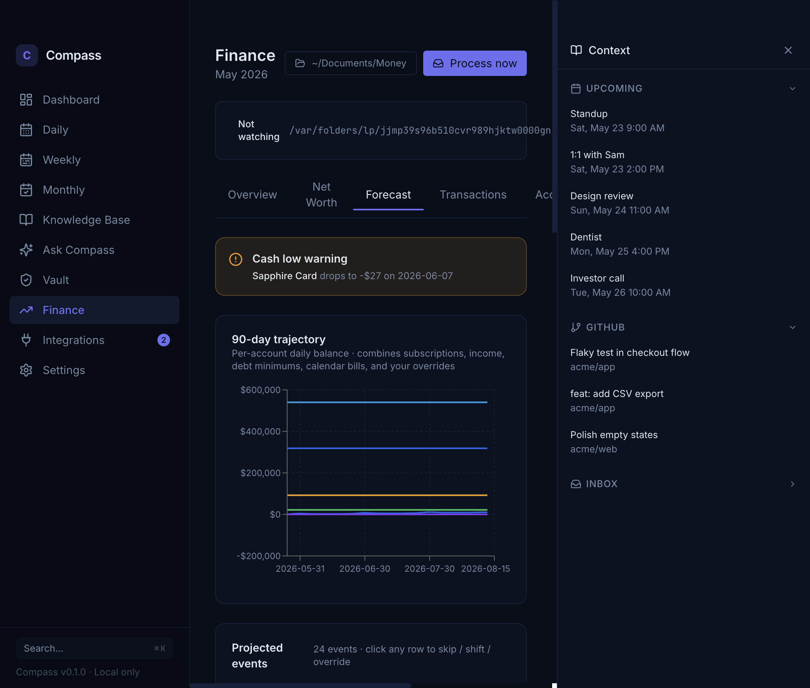 |
| **Knowledge base** — plain-markdown notes with `[[wikilinks]]`, backlinks, full-text + semantic search. | 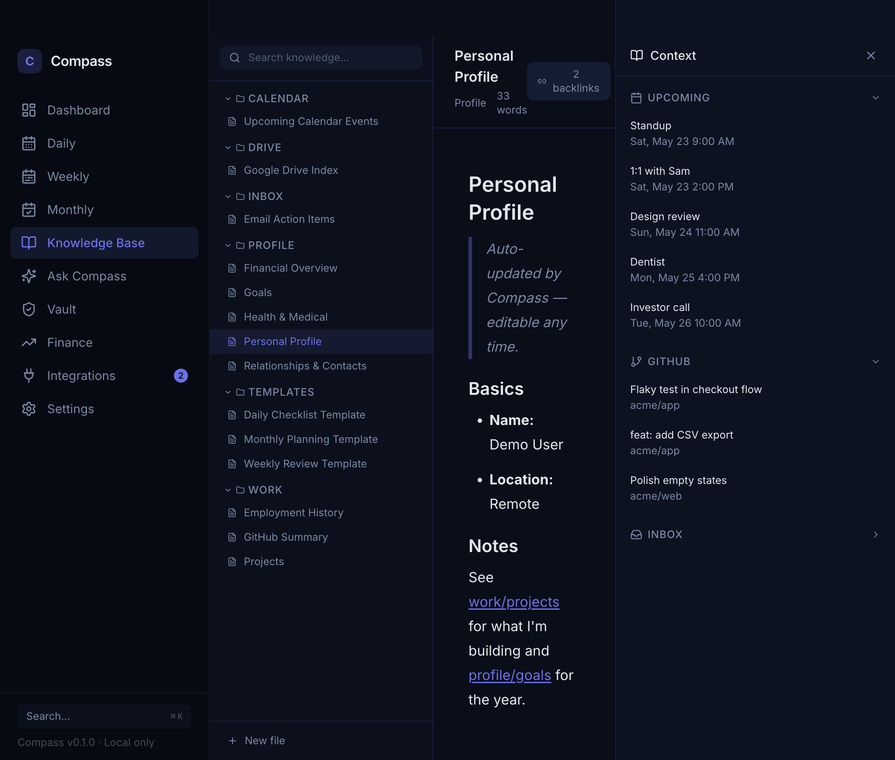 |
| **Ask Compass** — a RAG assistant grounded in *your* knowledge base. Bring your own key; runs against local Ollama first. | 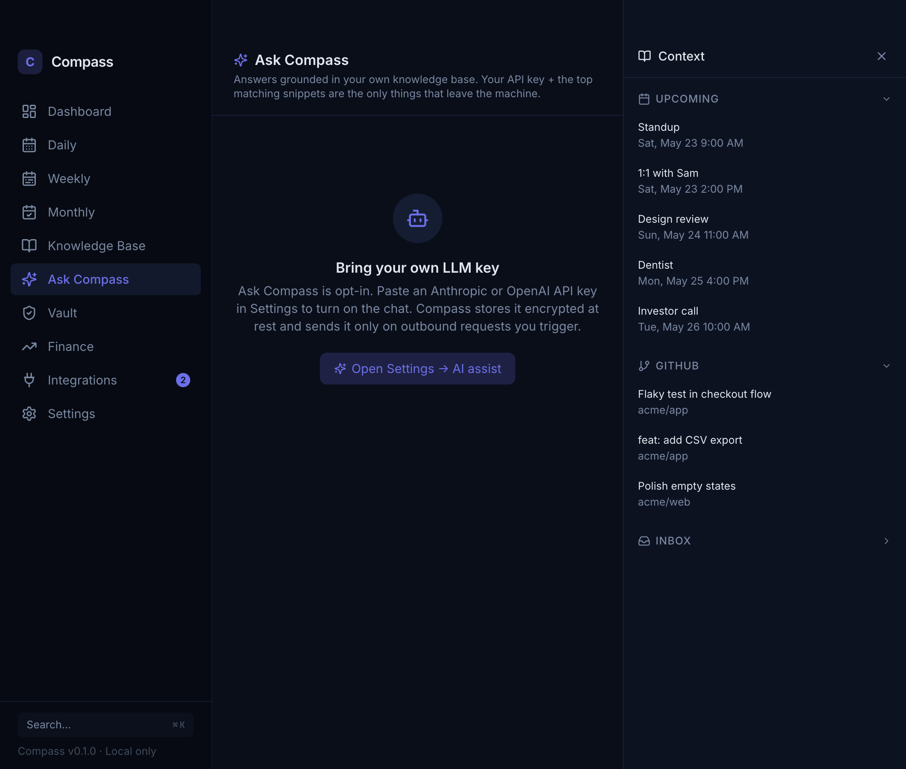 |
| **Weekly review** — a Sunday ritual: progress, open issues, what-went-well / blockers / next-week. | 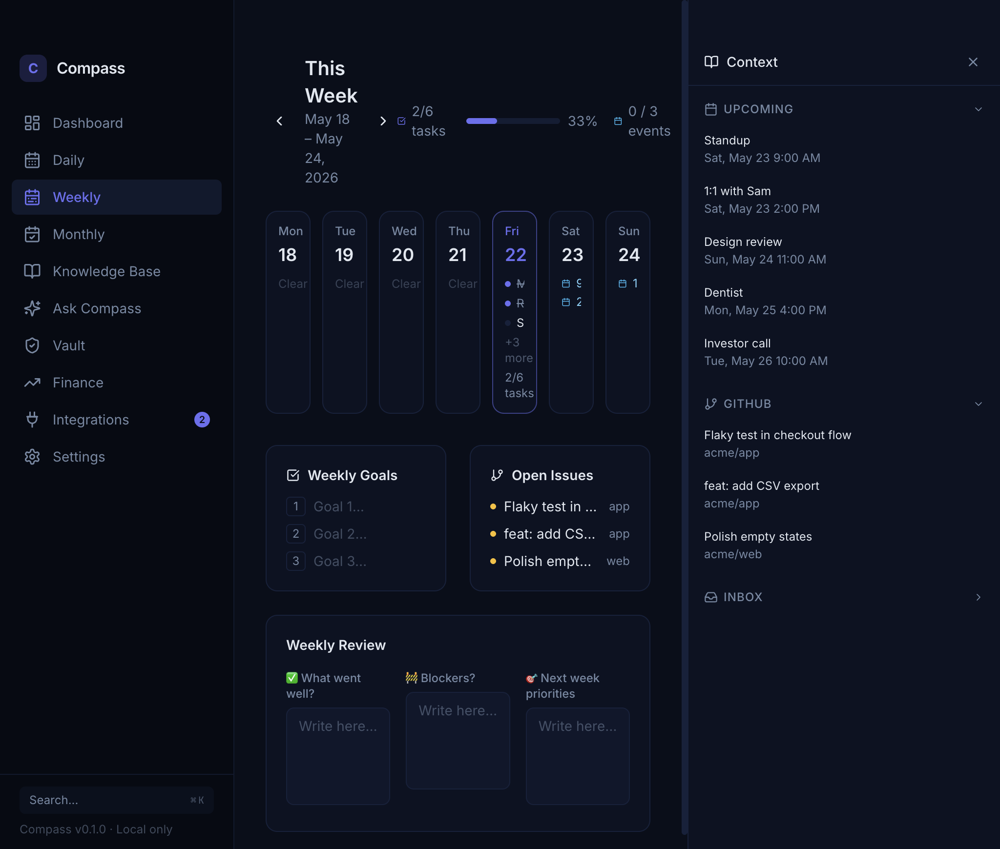 |
| **Encrypted vault** — AES-256-GCM secrets (financial, identity, credentials, medical, legal). Master key in the OS Keychain — never on disk in plaintext. | 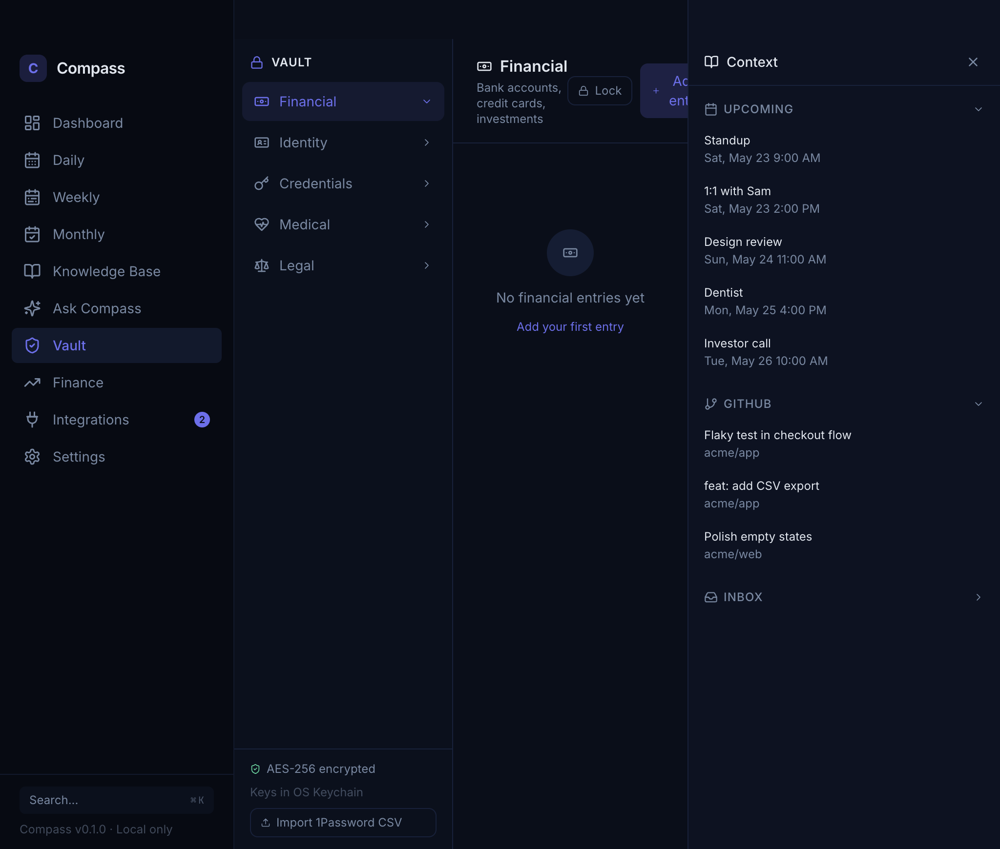 |

> Screenshots are generated from synthetic demo data via `npm run screenshots` (see [Generating screenshots](#generating-screenshots)). No real data is ever shown.

## Feature matrix

✅ Available today · 🔜 Upcoming (see [Roadmap](#roadmap))

| Area | Capabilities |
|---|---|
| **💰 Finance** | ✅ CSV / PDF / Excel statement ingest · ✅ auto-categorization · ✅ net-worth tracking + trajectory · ✅ 90-day cash-flow forecast · ✅ subscription & price-hike audit · ✅ budgets · ✅ Schedule C/E + capex tax tagging + tax-pack export · ✅ Plaid bank-linking · 🔜 receipts via email · 🔜 investment holdings |
| **📚 Knowledge** | ✅ markdown notes · ✅ `[[wikilinks]]` + backlinks · ✅ TipTap rich editor · ✅ full-text + semantic (local-embedding) search · ✅ Spotlight mirror · 🔜 Obsidian / Notion import-export · 🔜 web clipper |
| **🔐 Vault** | ✅ AES-256-GCM encrypted categories · ✅ OS-Keychain master key · ✅ auto-lock · ✅ 1Password CSV import · 🔜 encrypted sharing with a trusted partner |
| **📅 Calendar** | ✅ Google Calendar · ✅ Apple Calendar (local `.ics`, RRULE expansion) · 🔜 Outlook / Office 365 · 🔜 CalDAV |
| **✅ Tasks & habits** | ✅ daily / weekly / monthly checklists · ✅ habit streaks · ✅ tray quick-capture · ✅ `compass://` URL scheme · 🔜 Todoist / Things / Reminders sync · 🔜 voice capture |
| **🤖 Assistant** | ✅ RAG over your knowledge base · ✅ BYO Anthropic/OpenAI key · ✅ local Ollama option · 🔜 proactive insights · 🔜 agentic "plan my week" |
| **🔎 Search** | ✅ global ⌘K across notes, tasks, vault titles, transactions |
| **🔗 Integrations** | ✅ Google · ✅ GitHub · ✅ Gmail action items · ✅ Plaid · ✅ Apple Calendar · 🔜 Slack · 🔜 Linear / Jira · 🔜 Apple Health / Strava · 🔜 browser extension |
| **🧩 Platform** | ✅ local MCP server (agent introspection) · ✅ encrypted backup / restore · ✅ auto-update · 🔜 public plugin API + marketplace · 🔜 opt-in E2E-encrypted sync · 🔜 mobile companion |

## Architecture

Compass is an Electron app with a hard security boundary: the React renderer is sandboxed and can **only** talk to the Node main process through a typed IPC bridge. All data — SQLite DB, encrypted vault, markdown knowledge base — lives in your OS application-data directory (on macOS, the primary target: `~/Library/Application Support/Compass/`).

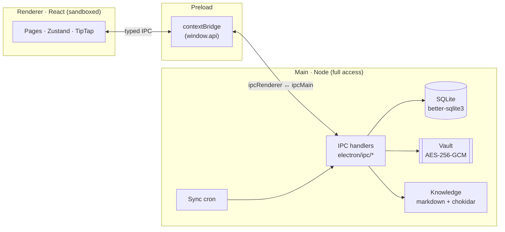

**`contextIsolation: true`, `nodeIntegration: false`** — the renderer never imports Node. CSP blocks remote scripts and eval in production.

### Your data stays yours

The only bytes that leave your machine are OAuth tokens (encrypted at rest) and the API calls *you* opt into — to pull *your own* data back.

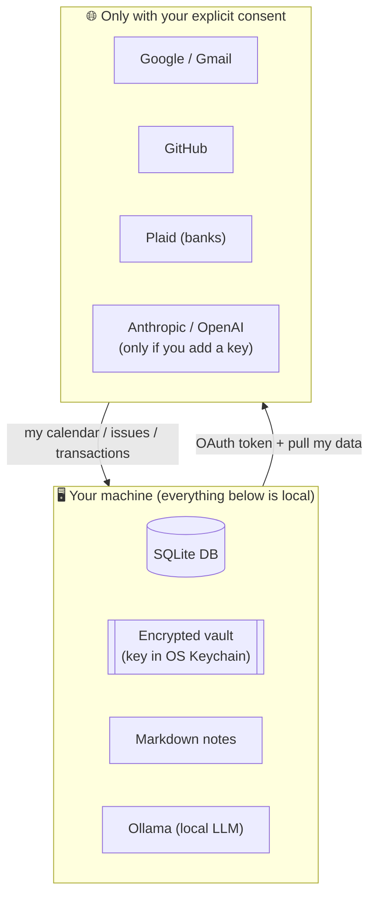

## Tech stack

**Electron 41** · **React 18** + **TypeScript** · **Drizzle ORM** / **SQLite** (`better-sqlite3`) · **TipTap** editor · **Recharts** · **Tailwind** (indigo-on-navy theme, Inter + JetBrains Mono) · **Vitest** + **Playwright** · **Biome** · **electron-vite** / **electron-builder**.

## Getting started

```bash
# Prerequisites: Node 20+ (nvm), npm
npm install          # installs deps + rebuilds native modules for Electron
npm run dev          # Electron + Vite HMR
npm run build        # production build
npm run typecheck    # renderer + main type-check
npm run check        # Biome lint + format
npm test             # Vitest unit tests
```

Primary target is **macOS** (signed releases via GitHub Actions); Windows (`nsis`/portable) and Linux (`AppImage`/`deb`) build targets exist. First launch seeds a starter knowledge base and an onboarding wizard.

### Generating screenshots

The images above are produced from **synthetic** demo data, never your real store:

```bash
npm run screenshots
```

This seeds a throwaway data dir (via the `COMPASS_HOME` override in `electron/paths.ts`), builds the app, drives it with Playwright, and writes PNGs to `docs/images/`. Your real app-data store (on macOS, `~/Library/Application Support/Compass`) is never touched.

## Roadmap

Compass is **100% local today.** The roadmap below is an expert-team evaluation of what turns it into a daily driver and a platform. Items marked *(opt-in cloud)* are a deliberate, clearly-bounded departure from local-only — always opt-in, never the default. Full detail + sizing lives in [`docs/implementation_plan.md` § Phase 7](docs/implementation_plan.md).

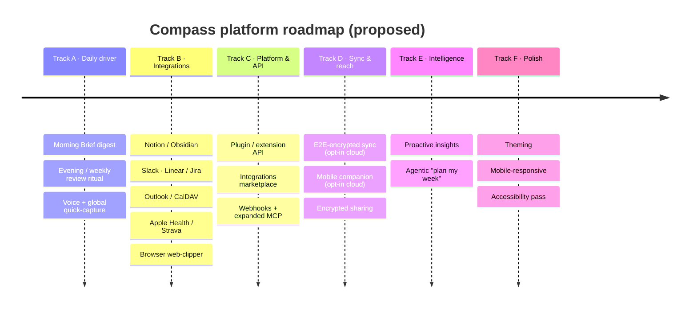

## Privacy & security

- **Local-first by default** — data lives on disk; nothing is uploaded to a Compass server (there is no Compass server).
- **Vault** — AES-256-GCM, random IV + authTag per blob; master key generated once and sealed by the OS Keychain (`safeStorage`). Plaintext secrets never hit disk.
- **OAuth tokens** — encrypted at rest, kept in the main process, never exposed to the renderer or logs.
- **AI is opt-in and local-first** — Ask Compass prefers a local Ollama model; cloud LLM keys are BYO and only used on requests you trigger.
- **Hardened renderer** — `contextIsolation`, no `nodeIntegration`, production CSP with an explicit network allowlist.

See [`docs/architecture.md`](docs/architecture.md) for the full security model.

## Documentation

- [`docs/architecture.md`](docs/architecture.md) — process boundary, DB schema, IPC map, security model
- [`docs/conventions.md`](docs/conventions.md) — TS/React style, IPC + toast patterns
- [`docs/integrations.md`](docs/integrations.md) — how to add a new integration
- [`docs/implementation_plan.md`](docs/implementation_plan.md) — full feature ledger + roadmap (Phase 7)

## License

Proprietary / all rights reserved (`UNLICENSED`). Not currently open for redistribution.
