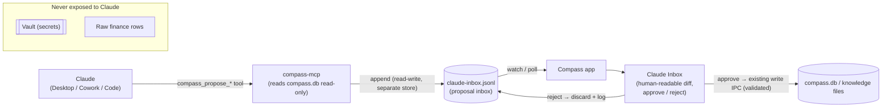

# Compass ↔ Claude — Integration Design

> **Status: fully shipped (8.1–8.6).** This documents how Compass becomes a first-class, **bidirectional** Claude citizen: the MCP **read + propose** tools (8.1), the in-app **Claude Inbox** approval surface (8.2), the one-click **`.mcpb` Desktop bundle** (8.3), the **end-user plugin + skills** (8.4/8.6), and the **embedded agent in Ask Compass** (8.5). Per-item status is tagged below and in [`implementation_plan.md` § Phase 8](implementation_plan.md).

## Why

Compass holds the things you'd most want an assistant to reason over — your tasks, calendar, notes, money, habits — but on *your* machine, not a vendor's cloud. Claude is the assistant. The opportunity is to connect them **both ways** without surrendering the local-first, privacy-first contract:

- **Claude → Compass:** ask questions and *act* on your life data from Claude Desktop, Cowork, or Claude Code.
- **Compass → Claude:** embed Claude's agentic reasoning natively (plan my week, proactive insights) inside the app.

The hard constraint: *let an assistant help with your life OS without letting it silently mutate it or leak it.* The whole design below exists to satisfy that.

## Today (shipped)

| Direction | What exists | Where |
|---|---|---|
| Claude → Compass | stdio MCP with **15 read tools** — `compass_today_tasks`, `compass_tasks`, `compass_search_knowledge`, `compass_read_knowledge_file`, `compass_recent_calendar`, `compass_recent_notes`, `compass_sync_status`, `compass_recent_commits`, `compass_test_status`, `compass_integration_health`, `compass_finance_summary`, `compass_habit_streaks`, `compass_upcoming`, `compass_timeline`, `compass_search_timeline` — **and `compass_propose_*` write-proposal tools** (task/note/txn-tag/habit-check) that enqueue to the Claude Inbox. **Vault excluded; finance raw rows excluded** — with one deliberate, documented exception: `compass_timeline` / `compass_search_timeline` read actual life-data records, not just aggregates (see § records exception below). | `mcp/compass-mcp/index.ts`, `proposals.ts`, `.mcp.json` |
| Claude → Compass (act) | **Claude Inbox** — proposals land in `claude_proposals`; the user approves/rejects in-app and approval applies the change via validated write logic (re-validated as a trust boundary). | `electron/ipc/claude.ts`, `src/pages/ClaudeInbox.tsx` |
| Compass → Claude | "Ask Compass" — BYO Anthropic/OpenAI key, RAG over local notes, plus the **agentic tool-use loop with prompt caching** (8.5). | `electron/ipc/assistant.ts`, `electron/integrations/llm-client.ts` |
| Packaging | **`compass`** end-user plugin (MCP + skills) for Cowork/Code from a repo checkout, **plus the self-contained one-click `.mcpb` Desktop bundle** (8.3 — `npm run build:mcpb`, attached to tagged releases). Separate from the **developer** `compass-stack` plugin (subagents/skills/hooks for *building* Compass). | `claude-plugin/`, `scripts/build-mcpb.ts`, `.claude/plugin.json` |

## Core architecture — the "Claude Inbox" (confirmed writes) ✅

The MCP server is a **separate process** that opens the main Compass DB (`compass.db`) **read-only**. It must never mutate app data. So writes are *proposals* appended to a **separate, append-only proposal inbox** (NOT the read-only main DB) — Compass stays the sole writer to its real data, and a human approves every change.

**Where proposals live (resolving the read-only constraint):** the MCP appends each proposal to a dedicated store it owns read-write — a JSONL file at `.data/claude-inbox.jsonl` (simplest), or its own small `claude-inbox.db` — distinct from the read-only `compass.db`. The running Compass app watches that store, mirrors entries into a `claude_proposals` table for status/history, and on approval writes the real change to `compass.db` / knowledge files via existing IPC. The MCP never touches `compass.db`, the vault, or knowledge files.

**Invariants (non-negotiable):**
1. Claude **never** writes `compass.db`, the vault, or knowledge files — it only appends to the separate, append-only proposal inbox.
2. Compass remains the **sole writer**, executing approved proposals through its **existing, input-validating** IPC handlers.
3. **Every** mutation is **human-approved** in the Claude Inbox and **audit-logged**.
4. The **vault is never exposed** to any Claude surface (read or write).
5. Finance is exposed as **summaries/aggregates only** — never raw transaction rows. **This does not apply uniformly to every domain:** Phase 10.7 "Converse" made one deliberate, documented exception — the `records` Timeline (purchases, media, messages, browsing, documents, health, credit/tax, connections, and more, imported from the user's own data exports) is searchable **in detail**, not just in aggregate, via `search_records` (embedded agent) / `compass_search_timeline` (MCP). This was a conscious relaxation for the user's *own acquired data*, scoped narrowly to the records store — vault and raw finance/transaction rows remain aggregates-only with no equivalent exception. `compass_timeline` / `get_timeline` stay aggregate-only (counts by source/kind/year); the detail read is a separate, explicitly-named tool.
6. Cloud LLM access stays **BYO-key, opt-in, local-first** (Ollama preferred).

## Phase 8 tracks (proposed)

### 8.1 MCP capability expansion ✅ *(shipped)*
Extends `mcp/compass-mcp/index.ts`:
- **New privacy-respecting reads:** `compass_finance_summary` (aggregates only), `compass_habit_streaks`, `compass_upcoming` (unified daily brief), `compass_tasks` (date-range checklist read, PR #167), `compass_recent_notes` (PR #167), `compass_timeline` (Phase 10.7 — aggregate counts over the unified life Timeline by source/kind/year), `compass_search_timeline` (Phase 10.7 — the detail-record read; see Invariant #5's records exception above).
- **Propose-write tools** (enqueue only): `compass_propose_task`, `compass_propose_note`, `compass_propose_txn_tag`, `compass_propose_habit_check` — in `proposals.ts`; each validates input, opens no DB / touches no vault, and appends a `status:'pending'` proposal to the append-only inbox (`<app-data>/.data/claude-inbox.jsonl`). Note paths are relative `.md` only (traversal blocked).
- Per-tool unit tests in `proposals.test.ts` (validation + enqueue round-trip). The JSONL line schema (`{ id, createdAt, status, source, type, payload }`) is the contract 8.2 consumes — keep it stable.

### 8.2 Claude Inbox — approval surface — ✅ *(shipped)*
- ✅ `claude_proposals` table (`electron/db/schema.ts`, migration `0010`) + `electron/ipc/claude.ts` (`claude:list-proposals` / `approve-proposal` / `reject-proposal` / `clear-resolved`) via the canonical preload + `electron.d.ts` 3-file pattern.
- ✅ Ingest reads the append-only `claude-inbox.jsonl`, dedups by the MCP-minted UUID, and tolerates malformed/partial lines. Approve applies the change and records `approved` + a `resultRef`; an apply failure marks the row `failed` with the error (nothing partially written). Reject/clear manage lifecycle.
- ✅ **Trust boundary:** the JSONL is LLM-written, so every field is re-validated on apply — path traversal via the shared `safeJoin`, the shared `TAX_TAGS` whitelist, the list-type domain, strict booleans, explicit habit state. The vault is never touched.
- ✅ A review **page** (`src/pages/ClaudeInbox.tsx`, route `/claude-inbox`, sidebar + ⌘K entry) surfaces pending proposals with a human-readable summary per type and one-click approve/reject (reusing `Toast` + `ConfirmDialog`) plus clear-resolved.

### 8.3 Claude Desktop connector (DXT / `.mcpb`) — ✅ *(shipped)*
- ✅ `npm run build:mcpb` (`scripts/build-mcpb.ts`) produces a self-contained **`.mcpb` bundle** (`dist/compass-mcp-<os>-<arch>.mcpb`): esbuild compiles the TS server (+ MCP SDK) into one ESM file, and the **`better-sqlite3` native binding is npm-installed into the bundle** (the previously-noted gate — per-arch via `npm_config_arch`). The manifest (`mcp/compass-mcp/mcpb-manifest.ts`, schema-validated in unit tests AND at build time) launches it with `COMPASS_MCP_BUNDLED=1`.
- ✅ **Bundled mode** (`mcp/compass-mcp/bundle-mode.ts`): drops the two repo self-knowledge tools (`compass_recent_commits`, `compass_test_status`) from `tools/list` and answers their calls with a clear error — there's no source checkout inside a bundle. All other tools (reads + proposals) behave identically.
- ✅ The build **smoke-tests** the bundled artifact with a real MCP `initialize` handshake (proves the native binding loads; skipped for cross-arch builds), and tagged releases attach `compass-mcp-darwin-{arm64,x64}.mcpb` automatically (`release.yml`).
- ✅ The **manual `claude_desktop_config.json` fallback** stays documented in `claude-plugin/README.md` (now framed as the from-checkout option). **Caveat:** the bundled binding matches the Node ABI of the build machine (CI: Node 22) — documented in `mcp/compass-mcp/README.md`.

### 8.4 Cowork plugin (end-user) — ✅ *(shipped)*
- `claude-plugin/` is a new **end-user** plugin (distinct from the dev `compass-stack`): `.claude-plugin/plugin.json` + `.mcp.json` register the Compass MCP and expose the 8.6 skills, with an install README (incl. the Claude Desktop manual-config fallback). A Cowork/Desktop/Code session can now run "do my weekly review", "what's my morning brief", etc.

### 8.5 Embedded Claude agent in Ask Compass — ✅ *(shipped)*
- ✅ `assistant:agent` runs a **bounded Anthropic tool-use loop** (`electron/ipc/assistant.ts`). The client (`llm-client.ts`) gained tool-use + **`cache_control` prompt caching** — kept **HTTP-only, no SDK** to match the codebase's deliberate "don't pull in LLM SDKs" convention.
- ✅ Tools (`electron/integrations/assistant-tools.ts`, `ASSISTANT_TOOLS`) — 9 today, all read-only except the last:
  - `get_upcoming` — today's tasks, near-term calendar, accounts with a payment due
  - `get_finance_summary` — **aggregates only** (net worth, monthly income/expense/net, current-month spend by category) — never individual transactions
  - `get_week_tasks` — daily-checklist tasks across a date range
  - `get_weekly_goals` — the week's goals
  - `get_habit_streaks` — current/longest streak per active habit
  - `get_insights` — the same proactive-insights data as the Dashboard "Worth a look" card
  - `get_timeline` — **aggregate** counts over the unified life Timeline (totals by source/kind/year) — see Invariant #5's records exception above
  - `search_records` — the **actual matching Timeline records** (not just aggregates) — the same documented "records" exception as the MCP's `compass_search_timeline` (Invariant #5 above)
  - `propose_task` — **enqueues a `pending` `claude_proposals` row** (→ the Claude Inbox) rather than writing directly. The same propose→approve funnel as the MCP.
  - Vault is excluded from every tool above; OpenAI keeps the single-shot RAG `ask` instead of the tool-use loop.
- ✅ Renderer **Agent toggle** in Ask Compass (`src/pages/Ask.tsx`) — routes through `assistant:agent`, shows the tool trace, and surfaces proposed changes as a banner linking to the Claude Inbox. Anthropic-only (auto-disabled for other providers).
- 🔜 More propose-write tools (notes, habits, txn-tag — mirroring the MCP's `compass_propose_*` set) and proactive-insights surfacing beyond the read-only `get_insights`.

### 8.6 Claude Skills for Compass — ✅ *(shipped)*
- `claude-plugin/skills/`: `morning-brief`, `weekly-review`, `budget-check`, `plan-my-week`, `capture-from-web`. Each is **read-first** (via the MCP read tools) and routes any change through `compass_propose_*` → the Claude Inbox approval flow — never a direct write. The vault is never exposed; finance stays at the summary level.

## Expert deep-dive (five lenses)

- **Integration architecture** — the read-only-MCP + proposal-queue split is what makes "confirmed writes" safe across a process boundary; the same propose→approve path serves Desktop, Cowork, Code, *and* the embedded Agent SDK, so there's one mutation funnel to secure and audit.
- **Security / privacy** — vault is categorically excluded; finance is summaries-not-rows; nothing mutates without a human; keys/tokens never leave the device except on user-triggered turns. The Claude Inbox is the consent + audit surface.
- **Product / UX** — the daily hook compounds: a **Claude-generated Morning Brief** (8.5/8.6) read *from* Compass, and "ask Claude to tidy my week" that lands as reviewable proposals *in* Compass. "Open in Claude" affordances on notes/tasks.
- **Platform / ecosystem** — the DXT bundle + Cowork plugin + skills library make Compass installable and discoverable wherever Claude runs; the MCP tool contract is the stable, versioned API.
- **Bidirectional flows** — *Claude→Compass:* "What did I spend on subscriptions last quarter?" (summary read) → "cancel-candidate list, add a task to review each" (proposals). *Compass→Claude:* Ask Compass runs "plan my week" agentically over calendar+tasks+goals, drafting a plan you accept into checklists.

## Build sequencing (when greenlit)
`8.1 → 8.2` (read + propose + inbox) is the spine. `8.3 / 8.4 / 8.6` are packaging on top. `8.5` is independent and high-value. Each ships as its own PR with tests.

## Related
- [`implementation_plan.md` § Phase 8](implementation_plan.md) — the tracked checklist (and Phase 7 for the broader platform roadmap; 8.5/8.6 realize parts of Phase 7 Tracks E + C).
- [`architecture.md`](architecture.md) — process boundary + IPC + security model the above builds on.
