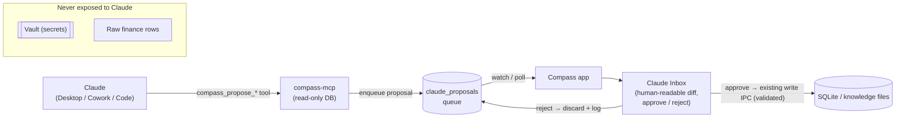

# Compass ↔ Claude — Integration Design

> **Status: design + roadmap (Phase 8, proposed).** This documents how Compass becomes a first-class, **bidirectional** Claude citizen. Most of it is **not built yet** — see the 🔜 tags and [`implementation_plan.md` § Phase 8](implementation_plan.md). Today's reality: a **read-only** MCP for **Claude Code** + a BYO-key "Ask Compass" assistant.

## Why

Compass holds the things you'd most want an assistant to reason over — your tasks, calendar, notes, money, habits — but on *your* machine, not a vendor's cloud. Claude is the assistant. The opportunity is to connect them **both ways** without surrendering the local-first, privacy-first contract:

- **Claude → Compass:** ask questions and *act* on your life data from Claude Desktop, Cowork, or Claude Code.
- **Compass → Claude:** embed Claude's agentic reasoning natively (plan my week, proactive insights) inside the app.

The hard constraint: *let an assistant help with your life OS without letting it silently mutate it or leak it.* The whole design below exists to satisfy that.

## Today (shipped)

| Direction | What exists | Where |
|---|---|---|
| Claude → Compass | Read-only stdio MCP, 8 tools (tasks, knowledge search/read, calendar, sync status, repo commits/test-status/integration-health). Registered for **Claude Code** only. **Vault excluded; finance raw rows excluded.** | `mcp/compass-mcp/index.ts`, `.mcp.json` |
| Compass → Claude | "Ask Compass" — BYO Anthropic/OpenAI key, raw `fetch` to the messages API, RAG over local notes. No tool-use, caching, or agentic loops. | `electron/ipc/assistant.ts`, `electron/integrations/llm-client.ts` |
| Packaging | `compass-stack` plugin bundles the **developer** agent infra (subagents/skills/hooks/MCP) for Claude Code — not an end-user data connector. | `.claude/plugin.json` |

## Core architecture — the "Claude Inbox" (confirmed writes) 🔜

The MCP server is a **separate process** that opens the DB **read-only**. It must never mutate app data directly. So writes are *proposals*, not mutations — Compass stays the sole writer, and a human approves every change.

**Invariants (non-negotiable):**
1. Claude **never** writes the DB, vault, or knowledge files directly — it only enqueues proposals.
2. Compass remains the **sole writer**, executing approved proposals through its **existing, input-validating** IPC handlers.
3. **Every** mutation is **human-approved** in the Claude Inbox and **audit-logged**.
4. The **vault is never exposed** to any Claude surface (read or write).
5. Finance is exposed as **summaries/aggregates only** — never raw transaction rows.
6. Cloud LLM access stays **BYO-key, opt-in, local-first** (Ollama preferred).

## Phase 8 tracks (proposed)

### 8.1 MCP capability expansion 🔜
Extend `mcp/compass-mcp/index.ts` (today's 8 read tools are the pattern):
- **New privacy-respecting reads:** `compass_finance_summary` (aggregates only), `compass_habit_streaks`, `compass_upcoming` (unified daily brief).
- **Propose-write tools** (enqueue only): `compass_propose_task`, `compass_propose_note`, `compass_propose_txn_tag`, `compass_propose_habit_check`.
- Versioned tool contract; per-tool unit tests + a proposal-enqueue test.

### 8.2 Claude Inbox — approval surface 🔜
- New `claude_proposals` table (`electron/db/schema.ts`) + `electron/ipc/claude.ts` (list / approve / reject / clear) via the canonical preload + `electron.d.ts` 3-file pattern.
- A review drawer/page reusing `src/components/ui/ConfirmDialog.tsx` + `Toast.tsx`; approve routes through existing write IPC (`checklist:add-item`, `knowledge:create-file`/`write-file`, `finance:update-transaction`/`set-transaction-tax-tag`, `habits:toggle`, …); full audit log.

### 8.3 Claude Desktop connector (DXT / `.mcpb`) 🔜
- Package `compass-mcp` as a one-click **desktop-extension bundle** (no dev toolchain) so any Claude Desktop user can connect their Compass; documented `claude_desktop_config.json` snippet as fallback. Ships read + propose tools.

### 8.4 Cowork plugin (end-user) 🔜
- A new **end-user** Cowork plugin (distinct from the dev `compass-stack`) bundling Compass skills (8.6) + the MCP, so Cowork sessions can run "do my weekly review", "tag last month's CR spend", etc.

### 8.5 Embedded Claude Agent SDK in Ask Compass 🔜
- Upgrade `electron/ipc/assistant.ts` + `electron/integrations/llm-client.ts` from raw `fetch` to the official **Claude Agent SDK** (or `@anthropic-ai/sdk` with tool-use): agentic loops with **tool-use over local data** (read + propose-write via the same inbox), **prompt caching** of the knowledge context, and flagship flows — **"plan my week"** and **proactive insights** (spend anomalies, stale notes, habit slippage). Still BYO-key, local-first.

### 8.6 Claude Skills for Compass 🔜
- Author skills usable across Desktop/Cowork/Code: `weekly-review`, `budget-check`, `morning-brief`, `capture-from-web`, `plan-my-week` — all operating through the MCP tools. Shipped in the Cowork plugin + DXT.

## Expert deep-dive (five lenses)

- **Integration architecture** — the read-only-MCP + proposal-queue split is what makes "confirmed writes" safe across a process boundary; the same propose→approve path serves Desktop, Cowork, Code, *and* the embedded Agent SDK, so there's one mutation funnel to secure and audit.
- **Security / privacy** — vault is categorically excluded; finance is summaries-not-rows; nothing mutates without a human; keys/tokens never leave the device except on user-triggered turns. The Claude Inbox is the consent + audit surface.
- **Product / UX** — the daily hook compounds: a **Claude-generated Morning Brief** (8.5/8.6) read *from* Compass, and "ask Claude to tidy my week" that lands as reviewable proposals *in* Compass. "Open in Claude" affordances on notes/tasks.
- **Platform / ecosystem** — the DXT bundle + Cowork plugin + skills library make Compass installable and discoverable wherever Claude runs; the MCP tool contract is the stable, versioned API.
- **Bidirectional flows** — *Claude→Compass:* "What did I spend on subscriptions last quarter?" (summary read) → "cancel-candidate list, add a task to review each" (proposals). *Compass→Claude:* Ask Compass runs "plan my week" agentically over calendar+tasks+goals, drafting a plan you accept into checklists.

## Build sequencing (when greenlit)
`8.1 → 8.2` (read + propose + inbox) is the spine. `8.3 / 8.4 / 8.6` are packaging on top. `8.5` is independent and high-value. Each ships as its own PR with tests.

## Related
- [`implementation_plan.md` § Phase 8](implementation_plan.md) — the tracked checklist (and Phase 7 for the broader platform roadmap; 8.5/8.6 realize parts of Phase 7 Tracks E + C).
- [`architecture.md`](architecture.md) — process boundary + IPC + security model the above builds on.
